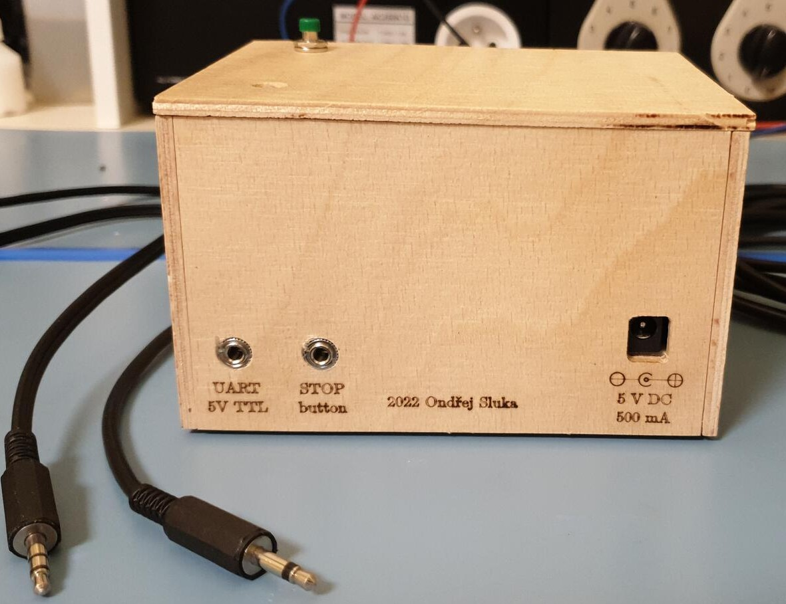
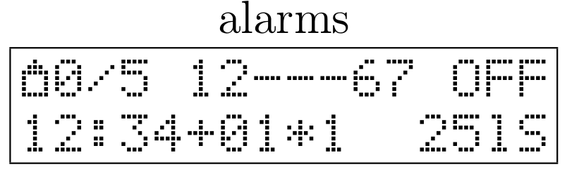
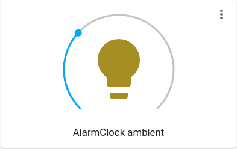
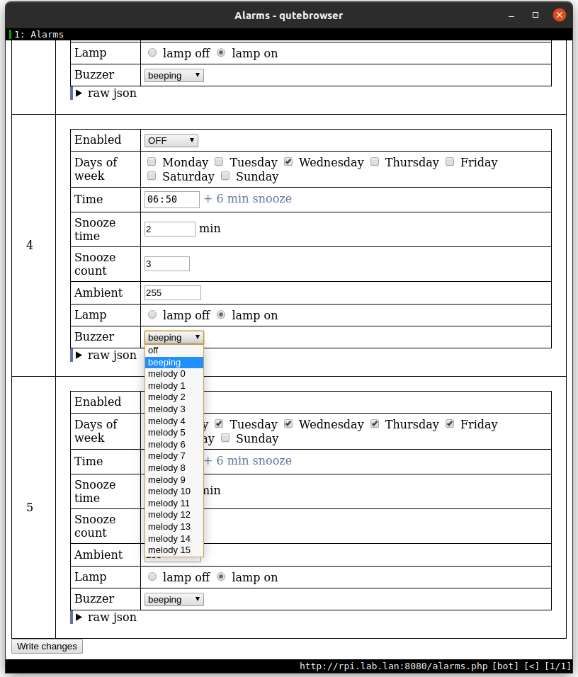

# AlarmClock
An Arduino-compatible alarm clock with multiple configurable alarms

Hardware design files are available in a separate repository:
[AlarmClock-hardware][AlarmClock-hardware]





## Features
- configurable number (default 6, max 16) of
  [configurable alarms](./docs/manual.md#Alarms)
- snooze feature with configurable time and count
- a different [ringing tone](./docs/manual.md#Ringing) when snooze cannot be
  used (last ringing)
- an LED that slowly lights up before the alarm sounds
  ([ambient](./docs/manual.md#Ambient-LED-strip))
- 2 separate buttons (snooze and stop). Stop can be installed further away
  from the bed, so that the user cannot reach it while still laying.
- a 16x2 character LCD with a rotary encoder for configuration
  ([GUI](./docs/manual.md#LCD))  
  
- an easy to parse serial port (UART) text-based configuration interface
  ([CLI](./docs/manual.md#Serial-CLI))
- a [Python library and MQTT adapter][PyAlarmClock] for easy control from a PC
  and automation (device needs to be connected to a server / PC via UART)  
  
- a [web-based configuration interface][AlarmClockWeb] (runs on PC, requires
  the MQTT adapter to be set up)  
  


## Building
Use [PlatformIO][PlatformIO] to build the firmware. It will handle the
dependencies automatically.

Upload to an Arduino UNO development board via UART:
```sh
# update libraries
make update

# compile
make

# upload via UART
make upload
```

Upload to the [AlarmClock-hardware][AlarmClock-hardware] board using USBasp:
```sh
# update libraries
make update

# compile
make ENVIRONMENT=atmega328p

# burn fuses and bootloader
make bootloader ENVIRONMENT=atmega328p

# upload using USBasp ICSP programmer
make upload ENVIRONMENT=atmega328p
```

For more information, type `make help`.

Building with Arduino IDE should be possible, but you might need to create a
few symlinks. I use PlatformIO exclusively for my testing, so Arduino IDE
should be considered unsupported.


## Testing
Static code analysis is performed on the computer used for development using
`cppcheck`.

Native unit tests run natively on the computer used for development.

Not everything can be tested that way, so additional tests were written that
need to run on the target microcontroller (embedded device). A new firmware is
uploaded to the device and test results are received through UART.
```
# run static code analysis:
make check

# run native tests:
make test

# run tests on embedded device:
make test_embedded
```


## Documentation
See the [manual][manual].

You can generate documentation for the source code using `doxygen`.
Just type `make docs`.


[manual]: ./docs/manual.md
[PyAlarmClock]: https://github.com/ondras12345/PyAlarmClock
[AlarmClockWeb]: https://github.com/ondras12345/AlarmClockWeb
[AlarmClock-hardware]: https://github.com/ondras12345/AlarmClock-hardware
[PlatformIO]: https://platformio.org/
